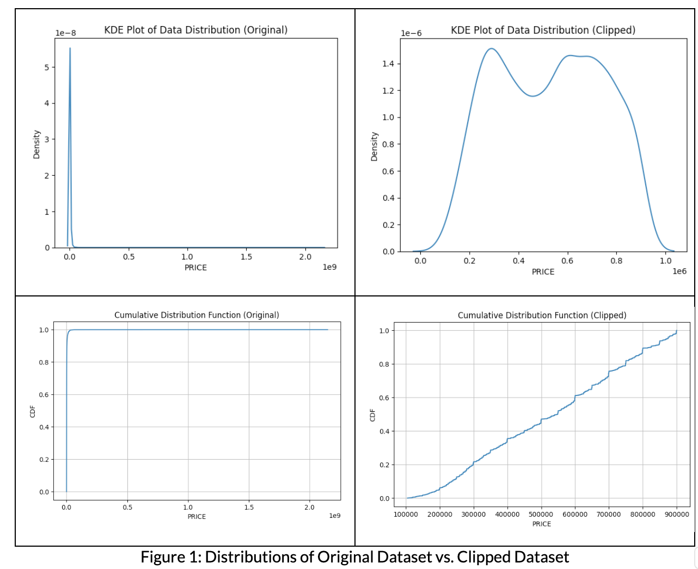

#### Authors: Jerry Chang, Khoa Ly, Liam Hyde, Luke Rowe
#### Under Guidance of: Dr. Rwebangira
#### Cal Poly SLO, CSC 466: Knowledge Discovery from Data

# Predicting New York City Housing Prices

## Abstract
As one of the hottest housing markets of America, New York City, New York offers up a myriad of housing, each with their own features. 
For those property owners that are selling in the current market, there are a basket of features to consider when appraising a reasonable sale price. 
Keeping track of all the features and manually relating them to a fair market price may pose a challenge to the average person. 
Luckily, employing some Machine Learning algorithms in this case can abstract much of the heavy lifting for us by developing models that can infer the relationships between our data for us. 
In NYC alone, median housing rises 9.2% yearly, and median rent has risen 25% since 2021. In such dynamic markets, ML helps us predict what housing prices may be, providing valuable insight into the state of the housing market in the city. 

## Introduction
In predicting NYC housing prices, we must familiarize ourselves with the factors related to the marketability of a unit. 
New York is separated into five boroughs: Manhattan, Brooklyn, Queens, Bronx, and Staten Island. Within the boroughs themselves, appraisals should consider housing density and make clear distinctions in social factors such as neighborhood prestige and transportation. 
Historical trends will be abstracted in this exploration and thus will not be explored beyond our dataset. 
On an individualistic scale, the housing needs of a homebuyer and marketability for sellers may be conditioned on to determine a price. 
For example, location, boroughs, numbers of bed and baths, housing type, etc. all play a part in a holistic assessment.

We have sourced our dataset from Kaggle [1]. The set includes information such as broker titles, house types, prices, number of bedrooms and bathrooms, property square footage, addresses, state, administrative and local areas, street names, and geographical coordinates. 
Each individual approach employed within our exploration will require different fields of the data and different formats of the data. As such, the dataset will be cleaned and organized appropriately for each approach.
To address this challenge, we are attempting to provide an estimate on a house, given features of the house. 

We will attempt this with four algorithms: K-Means Clustering, K-Nearest Neighbors, Decision Trees, and Linear Regression to compare and contrast their strengths and shortcomings for the challenge at hand. 
Within each Machine Learning algorithm, we clean and prepare the dataset to best suit each algorithm’s needs, while maintaining the integrity of relationships captured by the data.

## Goals
In addressing this challenge, we implement K-Means Clustering, K-Nearest Neighbors, Decision Trees, and Linear Regression. Within these four approaches, we will identify the best approach in the given scenario with the given dataset. 
We will do so by analyzing the shortcomings, adjustments, and practicality of each approach. 
To support our findings, we will compare accuracy metrics and determine the overall performance in the task.

## Implementation
### Linear Regression
Linear Regression was chosen as an approach due to its simplicity and interpretability. 
Linear regression attempts to find the linear relationship between the input features and the target variable (price). 
We used scikit-learn's LinearRegression class to fit a linear model on the training data.

For data cleaning and preprocessing, we performed several initial analyses of the target variable’s (‘PRICE’) distribution. 
We plotted the histograms and box plots of the original data as well as a random sampling. 
Additionally, we looked at the kernel density estimation and cumulative distribution function of our data to identify skews, biases, and outliers. 

From this, we filtered out houses with prices below $100k or above $900k, as well as houses with more than 7 bathrooms or 8 bedrooms as those were considered outliers. 

Figure 1: Distributions of Original Dataset vs. Clipped Dataset

We then one-hot encoded the categorical features like property type (‘TYPE’) and sublocality (‘SUBLOCALITY’). 
We also scaled the numerical features like square feet (‘PROPERTYSQFT’), number of bedrooms (‘BEDS’) and bathrooms (‘BATH’) using StandardScaler.

We ran two instances of linear regression, one on just the numerical features, and one with ‘TYPE’ and ‘SUBLOCALITY’ one-hot encoded. 
We used k-fold cross validation to ensure the stability of the training and testing. We used average r-squared and mean absolute error as our metrics to evaluate the performance of the algorithm.

### K-Means
K-Means clustering was chosen as an approach due to its versatility and ability to handle high-dimensional data. 
It's important to note that K-Means is an unsupervised learning algorithm, and in this implementation, we leveraged mean prices over clusters, treating the 'PRICE' field as a pseudo-label. 
This allowed us to cluster housing units with similar features together and take the average price to compare against a test point with analogous features, thereby assigning a predicted price. 
We implemented the K-Means algorithm in Python without relying on existing libraries.

To ensure compatibility, we made some modifications to the data structure. 
Firstly, we encoded the categorical data fields 'TYPE' and 'SUBLOCALITY' as numerical values to fit the interpolation requirements of K-Means. 
During this encoding process, we aimed to group similar categories together to maintain a smoother logical representation.

For example, housing units in "Brooklyn" have closer logical associations with "Kings County" and "Brooklyn Heights" than with neighborhoods and counties of other boroughs. 
By keeping similar data points closer together in value, they would be grouped more closely in space during clustering. 
However, we did not identify a specific scale for these groupings and assigned increasing values to avoid imparting our own biases into the data. 
This approach was ultimately taken to preserve the integrity of the original data.

Subsequently, we normalized the data to address challenges arising from high dimensionality. 
We also tuned hyperparameters such as the initial number of cluster centroids and ratios for k-fold cross-validation to optimize performance. 
Although normalization and K-Fold CV did not improve the overall performance, they did contribute to more stable predictions. 
In the end, to account for tighter performance, we filtered out outliers in the data, including only housing units priced between $100,000 and $1,000,000. 
Additionally, housing units with abnormal numbers of bedrooms and bathrooms were excluded from the dataset.

### K-Nearest Neighbors
K-Nearest Neighbors (KNN) was chosen as an approach because it aligns well with how the housing market actually works. 
Houses are typically priced based on their similarity to other houses that have been historically sold, which is analogous to the conceptual approach of KNN. 
In our implementation, we utilized the scikit-learn KNeighborsRegressor, along with several other scikit-learn features like column transformation and k-fold cross-validation.

Data cleaning involved filtering out houses with prices below $100,000 or above $900,000, as well as houses with more than 7 bathrooms or 8 bedrooms, as these were considered outliers. 
We also used the geohash library to combine latitude and longitude into a single column. The selected features were property square feet, type of house, number of bedrooms and bathrooms, locality and sublocality, and geohash. 
All features except property square feet were categorical, so we one-hot encoded them. For the property square feet feature, we used StandardScaler.

We employed k-fold cross-validation with 11 folds to tune the k parameter, and found that k=11 performed the best. However, even with the optimal value of k, the mean absolute error of the model was still 95,257.49, which is not ideal. 
To improve performance, we decided to create a custom distance metric that used Hamming distance for categorical features and Euclidean distance for numerical features.
Unfortunately, this significantly increased the cross-validation process time from approximately one minute to two hours. 
We ran the model once with the new distance metric while keeping all other parameters the same, but the results were worse than the original approach. 
It is possible that tuning other parameters could have led to better performance, but confirming this was not viable.

### Decision Trees
Decision Trees was initially chosen at random to evaluate the effectiveness of using an algorithm before conducting research on it. 
This choice was made prior to the lectures and information provided during class. Upon understanding how Decision Trees operate, we quickly realized that it might not be an ideal approach for this problem. 
Nonetheless, we implemented the following and observed poor performance. Decision Trees operate on the basis of entropy and information gain maximization, following an if-then rule system. 
The original design choice was to create a moderate amount of leaves and depth in the algorithm to prevent overfitting and allow the graph to predict a probability range for how certain properties affect price changes. 
However, this initial thought did not yield favorable results, resulting in a performance below 1%.

Consequently, we adjusted and tweaked the parameters of the Decision Tree implementation in scikit-learn. We chose scikit-learn for its known performance and automatic feature/node probability selection. 
To achieve the highest scores, we ended up implementing a heavily over-fitted Decision Tree model. This approach yielded the maximum number of correct guesses. 
The most likely reason for this is that the provided information does not adequately convey the true worth of the properties, such as the extent of renovations, modernity, style, etc., which were not included in the dataset. 
For this reason, one can assume that generating as many possible profiles for each data point is necessary to effectively "find clones" of different houses. Over-fitting became essential because, given the data points, the model had to find the house maximally close to the one being predicted.
In terms of code structure, we created simple function calls and included predictions at the end to observe actual and predicted values, gaining insights into when the model performed well or poorly. The data cleaning portion was crucial because the data contained many outliers. For instance, houses with 12 bedrooms or homes worth over a million dollars did not appear frequently. These properties could be justifiably ignored because most individuals seeking such properties would likely employ a brokerage service with knowledge of the real-world value of homes and features that cannot be easily automated. There was a performance gain with the deletion of such houses, most likely because the training and test sets contained both, and the model chose the closest nodes to what it was handling. However, with such rare properties on the market, the model would consistently miss the mark.

## Results
### Linear Regression
The linear regression model achieved a Mean Absolute Error (MAE) of $133,436 when using both numerical features (e.g. square feet, number of bedrooms/bathrooms) and categorical features like property 'TYPE' and 'SUBLOCALITY' that were one-hot encoded. 
When using just the numerical features, the MAE was higher at $150,715.

The R-squared value, which indicates how well the model fits the data, was 0.409 for the model with both numerical and categorical features included. 
This means the linear model explains about 41% of the variance in housing prices based on the included features. 
For just the numerical features, the R-squared dropped to 0.289, indicating worse fit.

Figure 2: Comparison of Actual vs. Predicted Prices for Numerical Only & Numerical w/ Categorical Data

A few key interpretations and potential reasons for the modest performance:
Including the categorical features improved both MAE and R-squared, suggesting property type and sublocality contain relevant information for predicting prices. 
However, there may be other important categorical variables missing like neighborhood quality, school district ratings, etc.
The MAEs of $133K-$151K on average are quite high in absolute terms. This level of error makes the model impractical for precisely predicting home prices individuals would rely on. 
The underlying assumption of a linear relationship between the features and price may be too restrictive.
The modest R-squared values (0.409 and 0.289) indicate the linear model is missing key variables that strongly influence housing prices. Some factors like view quality, construction age/condition, amenities and curb appeal are hard to quantify but strongly impact prices.
Housing prices can have very non-linear relationships and interaction effects between the features that a linear model cannot adequately capture. For example, similar square footage could mean very different prices in an upscale vs lower-income area.
The data may contain outliers or noisy data points that disproportionately impact the linear regression line fitted through all points. More robust methods may be needed.
Overall, while including categorical variables provided some improvement, linear regression alone does not appear sufficiently accurate or descriptive for precise home price prediction. This could be due to missing features, non-linear relationships, outliers or the rigid assumptions of linear regression. More advanced techniques like random forests, gradient boosting or neural networks that can better model complex relationships and interactions may be required, potentially alongside enriching the dataset with additional relevant features.

### K-Means
In evaluating the effectiveness of the K-Means algorithm, we found the MAE (Mean Average Error) of each iteration of predictions, then across the training set as a whole while performing K-Fold Cross Validation. 
In doing so, we find a more stable error in housing price predictions vs. a simple Test Set split (See Figure 3 Below).

Figure 3: Performance of Test Set vs. K-Fold Cross Validation on the K-Means approach.
	
While K-Means’ performance stabilized, it still has a large margin of error that does not address the challenge of housing price prediction effectively. 
The MAE hovers around ~130,000 USD with outlier filtering and ~2 million USD without, a value much too large for the average homeowner to consider. 
In doing the filtering, we limit the scope of our prediction task as well to homes within an arbitrary price range and bed & bath scope. In a real-world setting, the MAE of our predictions are not an insignificant sum, and thus is unfit for this problem. 
This may be due to a variety of reasons. For example, the dataset itself may be too small to capture the complexity of relationships in the data for K-Means to detect. 
A unit may have multiple features to consider such as its position on the street, the neighborhood it lies in, the businesses around, transportation available, reputation, etc. 
This type of data is not simple, and is not typically captured in housing sale data. Without these fields, the model we train on the given dataset will not be able to capture the relationships between them and the unit. 
Even with the information available, there is a large range in the units described. Within the dataset, a multi-million dollar condo may be statistically similar to a unit under a million in high dimensional space, but differ vastly in price by grace of neighborhood desirability. 
Even within the features, there is a large range. Simply put, the dataset may be too sparse for the spread of information considered, so this model suffers from the Curse of Dimensionality. 
K-Means also only clusters close points together, smoothing out outlying features if they are close enough through euclidean space. Hence, the algorithm is not resistant to outliers and fails in being sensitive to more complex representations.

### K-Nearest Neighbors
The best mean absolute error we acquired for K-Nearest Neighbors was 95,257.49 with 10-fold cross-validation and a k value of 11, which was the best of any of the algorithms that we implemented but still not ideal. 
In order to show our best case results, we used a train test split of .8/.2 to demonstrate our best case 11-Nearest Neighbors model. The distribution of actual vs predicted prices (see Figure 4 below) was relatively similar, however due to the nature of K-Nearest Neighbors it skews towards the middle of the distribution for predictions no matter what price threshold we chose when cleaning data.	

Figure 4: Distribution of Actual vs. Predicted Prices for 11-Nearest Neighbors

Using a scatter plot to compare actual vs predicted price (see Figure 5 below), we can see a moderate linear relationship between them with an R^2 value of 0.58 indicating that our model captures 58% of the variance in price.

Figure 5: Actual vs. Predicted Prices for 11-Nearest Neighbors

### Decision Trees
The performance of decision trees were suboptimal, the accuracy of the model was a mere 3.2%. With each iteration of expanding and closing off different features from the model such as latitude, longitude, type, address, etc. 
We saw different performance gains and losses. Initially the model predicted with the accuracy of .06%. This means that with the adjustment of different values we achieved we achieved 53.3 times the performance of the initial model. 
This all is moot however when the end result is a mere accuracy of 3.2%. The metrics tell us that the decision tree is a poor algorithm to use for something that varies so differently from housing group to housing group. 

This can also be applied to the fact that each category implemented had massive sliding scales with beds running from 1 bed to 7 beds for the clipped data. 
Additionally other metrics like sq ft, have integer amounts that could vary hundreds of times. Decision trees are primarily optimized for dataset’s that have a low amount of variability for each feature. 
The primary use of implementing such a poor predictor was to highlight the issues with blindly implementing an algorithm that a given dataset was not meant for.

## Concluding Thoughts and Future Work
Among the algorithms evaluated, K-Nearest Neighbors (K-NN) demonstrated the best performance. 
However, the overall consensus was that these models were not sufficiently sensitive to the nuanced relationships present in the data, and the dataset itself failed to capture specific details regarding the condition of each housing unit. 
Consequently, the predictions remained suboptimal for such a diverse range of housing units.

For future work, we recommend scaling down the scope of the project to smaller geographical areas, such as individual boroughs or neighborhoods. 
Additionally, we propose scaling down the scope further by training individual models tailored to similar housing types and features, thereby increasing prediction granularity. 
This approach could potentially yield valuable improvements in accuracy.

Overall, we recognize the need for more comprehensive data and additional data fields to capture the complex factors that contribute to a housing unit's price. 
Representing categorical data more effectively and employing cross-validation techniques for feature selection could help mitigate the impact of noisy features that do not significantly contribute to the task of predicting housing prices.

In terms of model design, we suggest focusing on a specific approach or exploring entirely different methodologies that are more sensitive to complex data, such as neural networks. 
These models may be better equipped to handle the intricate relationships and interactions present in the dataset, ultimately leading to more accurate and reliable predictions.

By addressing the limitations identified in this project, future endeavors can potentially unlock more precise and valuable insights into the housing market, benefiting various stakeholders, including homebuyers, sellers, and real estate professionals.

## References
[1] Nidula Elgiriyewithana, “New York Housing Market,” Kaggle, https://www.kaggle.com/datasets/nelgiriyewithana/new-york-housing-market/data (accessed Feb. 29, 2024).

[2]“New York First-Time Home Buyer | 2023 Programs & Grants,” Mortgage Rates, Mortgage News and Strategy : The Mortgage Reports, Mar. 20, 2023. https://themortgagereports.com/77793/ny-first-time-home-buyer-programs-grants
